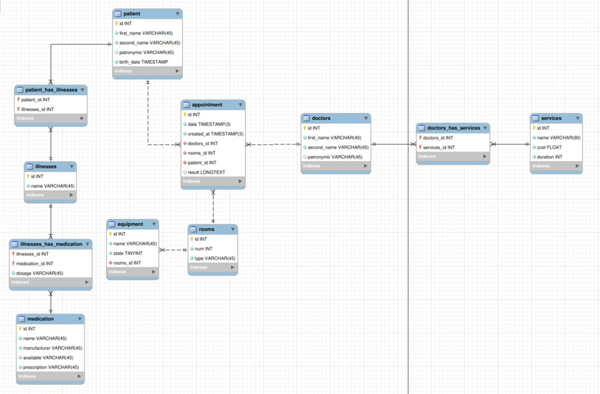

# **Проектирование и разработка базы данных для клиники**

## **Описание проекта**

В проекте была спроектирована и разработана реляционная база данных для предметной области **"Больница"**. Также был автоматизирован процесс записи пациентов на прием и отслеживание их медицинских данных. Проект включал в себя реализацию структуры БД с помощью SQL-скриптов и разработку различных запросов, а также процедур и триггеров для автоматизации процессов.

## **Использованные инструменты**

* **SQL**   
* **MySQL Workbench**

## **Структура базы данных**

База данных реализована на MySQL и состоит из следующих таблиц, связанных между собой:

* doctors: Информация о врачах (ФИО, специализация).  
* rooms: Информация о кабинетах (номер, тип).  
* patient: Основные данные пациентов.  
* services: Перечень услуг клиники.  
* appointment: Журнал записей на прием, связывающий пациентов, врачей и услуги.  
* equipment: Данные о медицинском оборудовании.  
* illnesses: Справочник заболеваний.  
* medication: Информация о лекарственных препаратах.  
* analyses: Справочник проводимых анализов.

### **Диаграмма**


Примеры заполнения таблиц:
```sql
INSERT INTO services (id, name, cost, duration) VALUES
(1, 'GP appointment', 0, 15),
(2, 'x-ray', 1500, 20),
(3, 'CT', 3000, 30),
(4, 'surgery', 10000, 90),
(5, 'electrocardiography', 1000, 30);
```
```sql
INSERT INTO rooms (id, num, type) VALUES
(1, 101, 'general'),
(2, 102, 'general'),
(3, 201, 'x-ray'),
(4, 202, 'cardiology'),
(5, 301, 'surgery');
```

## **Ключевые запросы и операции**

В ходе работы были созданы и протестированы различные запросы для управления данными и их извлечения.

### **Операции реляционной алгебры**

* **Проекция**: Выбор всех типов кабинетов из таблицы rooms.  

```sql
SELECT type FROM rooms;
```

* **Соединение**: Получение списка врачей и услуг, которые они предоставляют, через таблицу appointment.  
```sql
SELECT d.first_name, d.second_name, s.name  
  FROM appointment a  
  JOIN services s ON a.services_id = s.id  
  JOIN doctors d ON a.doctors_id = d.id;
```
  

### **Автоматизация процессов**

Для повышения эффективности работы базы данных были разработаны следующие элементы:

* **Функция apply\_appointment**: Хранимая функция, которая автоматически создает новую запись на прием для пациента, ищет свободного хирурга и подходящий операционный кабинет с доступным оборудованием.  
* **Триггер trig**: Срабатывает после добавления нового результата анализа для пациента. Если результат "плохой" (\_bad) и был получен в течение последних двух дней, триггер автоматически вызывает функцию apply\_appointment для записи пациента на операцию. В случае неудачи выдается соответствующая ошибка.

## **Выводы**

Проект демонстрирует навыки проектирования и реализации реляционных баз данных. Была разработана логичная и масштабируемая структура с соблюдением 1NF, 2NF и 3NF. А также созданы SQL-скрипты для автоматизации и эффективного управления данными.

## **Ключевые навыки**

* Проектирование баз данных  
* Знание SQL (включая DDL, DML, JOIN и подзапросы)  
* Навыки создания хранимых функций и триггеров  
* Работа с СУБД MySQL и инструментом MySQL Workbench