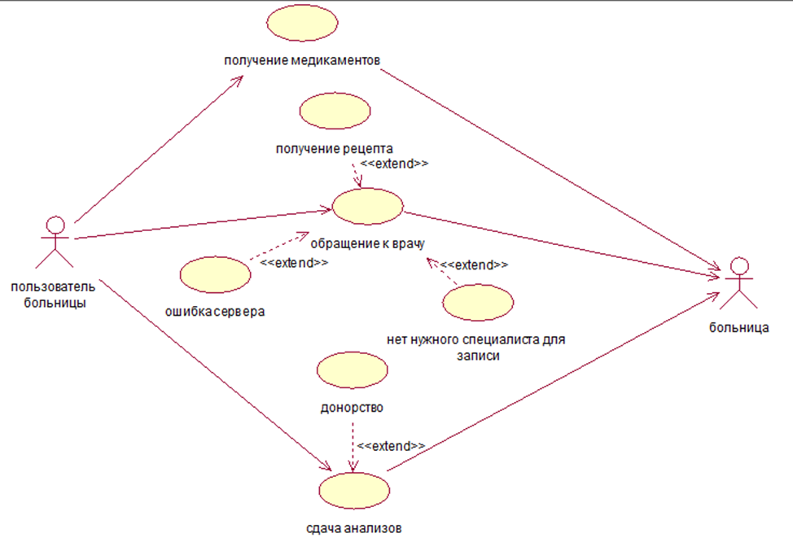
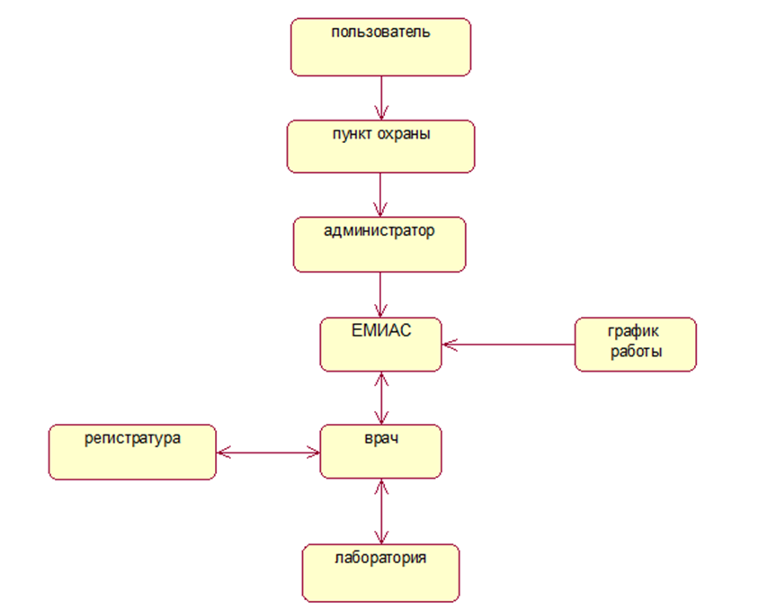
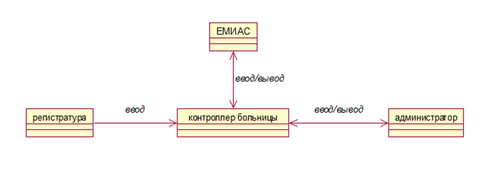
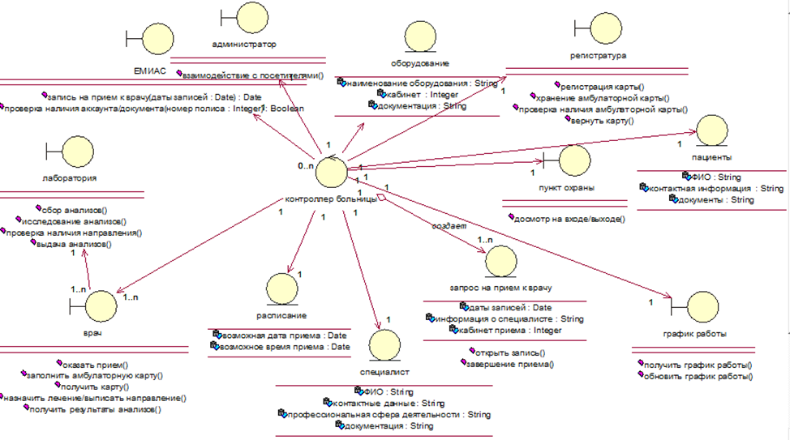
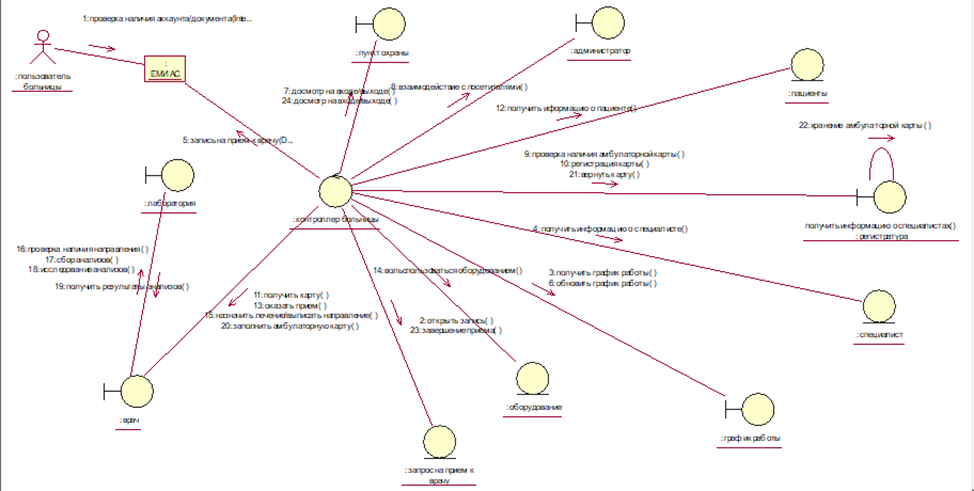
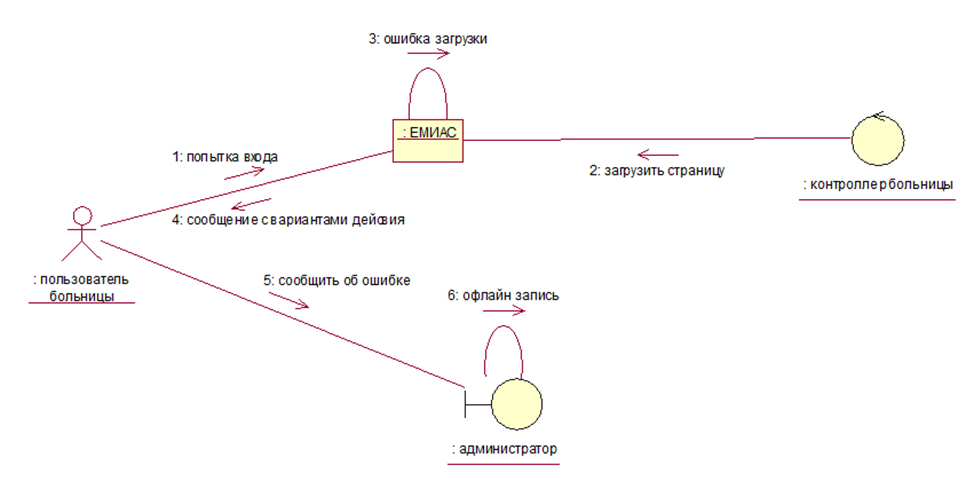
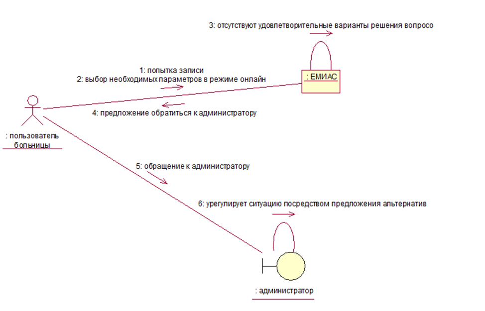
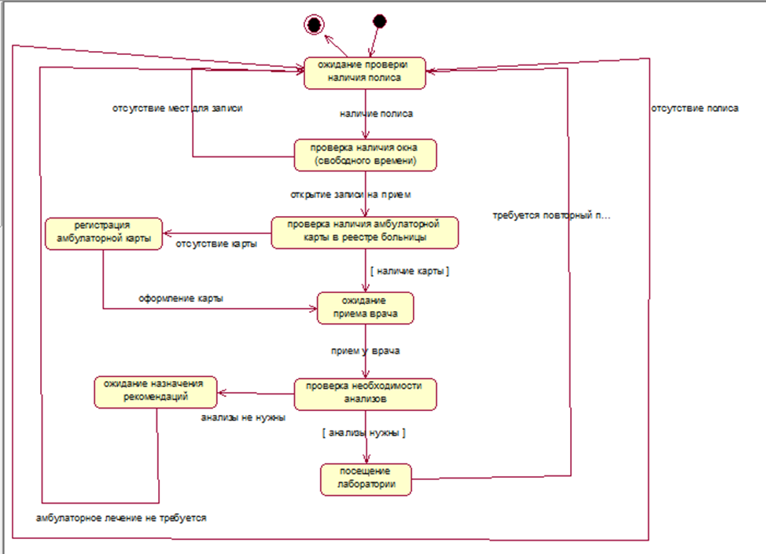
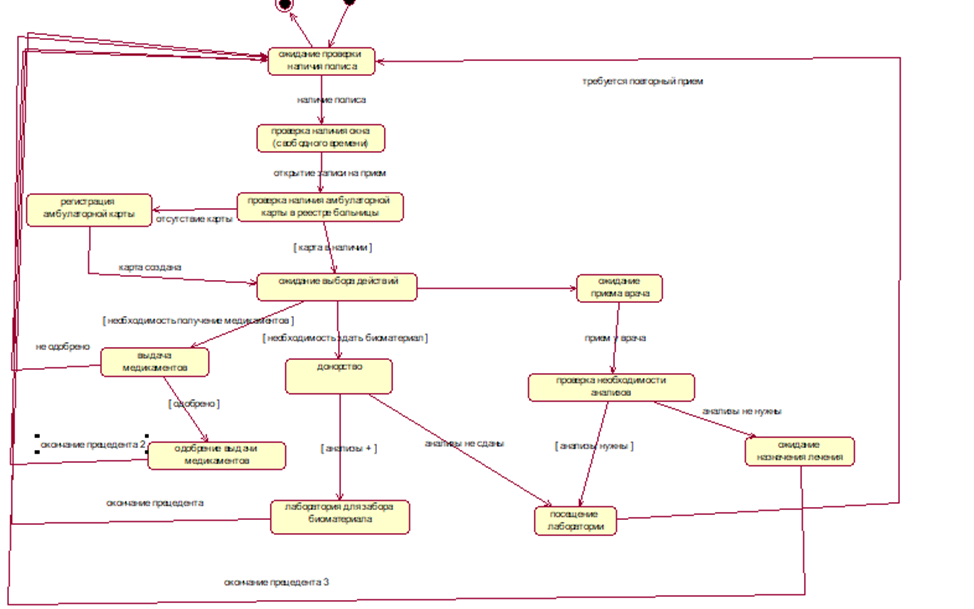

# **Проектирование информационной системы "Больница"**

## **Описание проекта**

Данный проект представляет собой практическую работу по проектированию информационной системы для управления больницей с использованием нотации UML. В ходе работы была разработана статическая, динамическая и аналитическая модели системы, которые включают диаграммы прецедентов, классов, кооперации и состояний. Цель проекта — изучить и применить на практике подходы к моделированию систем.

## **Использованные инструменты**

* **StarUML**  

## **Модели и диаграммы**

### **Модель прецедентов**

Модель описывает взаимодействие актеров (Пользователь и Больница) с системой.  
Основные прецеденты:

* **Получение медикаментов**  
* **Обращение к врачу**  
* **Донорство**

Также были добавлены абстрактные прецеденты:

* **Ошибка подключения к серверу**  
* **Нет нужного специалиста для записи**

### **Статическая модель**

Статическая модель отображает структуру системы, её классы и их отношения.

* **Концептуальная модель**: Показаны основные физические классы, такие как администратор, врач, лаборатория. 

* **Диаграмма контекста**: Отображает внешние устройства, взаимодействующие с системой.  

* **Диаграмма классов**: Подробно описывает классы и их методы, включая контроллер больницы, администратор, регистратура, врач и другие.

### **Динамическая модель**

Динамическая модель показывает поведение системы во времени.

**Диаграмма кооперации**: Описывает последовательность сообщений между объектами для каждого прецедента.
* **Диаграмма кооперации** для прецедента "обращение к врачу"

* **Диаграмма кооперации** для прецедента "ошибка подключения к серверу"

* **Диаграмма кооперации** для прецедента "нет нужного специалиста для записи"

### **Модель состояний**

Модель состояний детализирует жизненный цикл объекта, показывая его возможные состояния и переходы между ними.

* **Диаграмма состояний для прецедента "обращение к врачу"**: Показывает полный процесс от проверки полиса до получения лечения или сдачи анализов.  

* **Консолидированная диаграмма состояний**: Объединяет все прецеденты в одну модель для полного представления поведения системы.

## **Выводы**

В ходе выполнения проекта были успешно построены и описаны различные модели системы "Больница" с использованием нотации UML. Практическая работа позволила закрепить навыки в создании статической, динамической и аналитической моделей, что является важным этапом в проектировании информационных систем.

## **Ключевые навыки**

* Проектирование информационных систем  
* Моделирование с использованием UML (диаграммы прецедентов, классов, кооперации, состояний)  
* Анализ предметной области